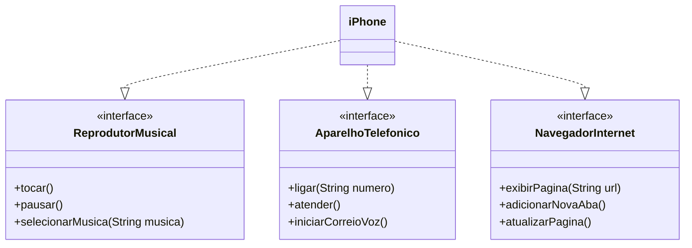

### Modelagem e Diagramação de um Componente iPhone

```mermaid
classDiagram
    class iPhone {
    }

    iPhone ..|> ReprodutorMusical
    iPhone ..|> AparelhoTelefonico
    iPhone ..|> NavegadorInternet

    class ReprodutorMusical {
        <<interface>>
        +tocar()
        +pausar()
        +selecionarMusica(String musica)
    }

    class AparelhoTelefonico {
        <<interface>>
        +ligar(String numero)
        +atender()
        +iniciarCorreioVoz()
    }

    class NavegadorInternet {
        <<interface>>
        +exibirPagina(String url)
        +adicionarNovaAba()
        +atualizarPagina()
    }

```